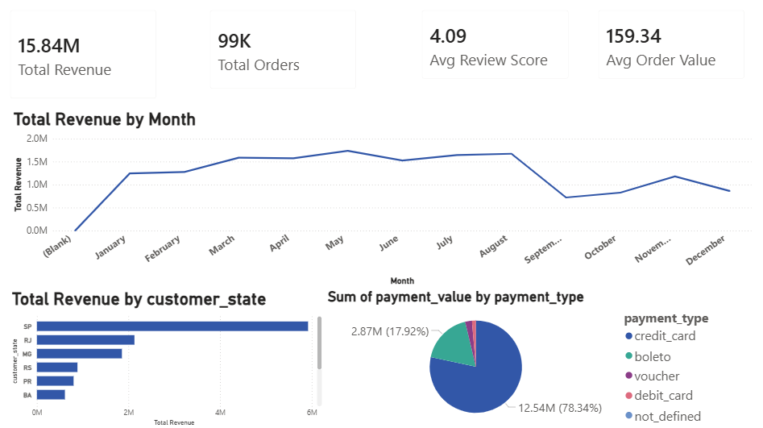
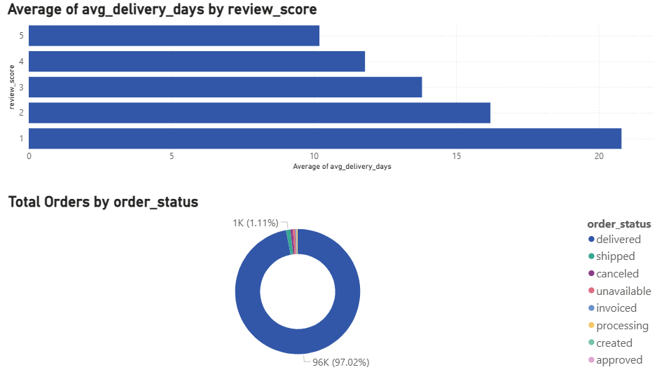
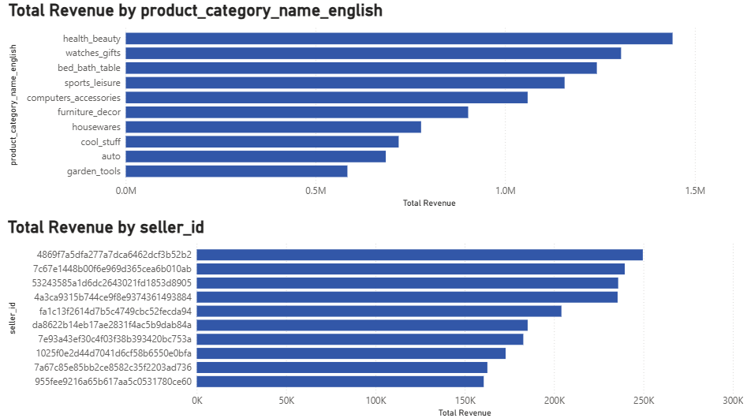

# 🛒 E-Commerce Sales Analysis


## 📌 Project Overview

An end-to-end data analysis project on the **Olist Brazilian E-Commerce** dataset, covering the full data analysis pipeline from raw data ingestion to an interactive Power BI dashboard.

The project answers real business questions about sales performance, customer satisfaction, delivery efficiency, and product trends using **Python**, **SQL**, and **Power BI**.

---

## 🎯 Business Questions

- 📈 What is the monthly revenue and orders trend?
- 🌍 Which states generate the most revenue?
- ⭐ How does delivery time affect customer satisfaction?
- 🛍️ What are the top-performing product categories?
- 💳 What payment methods do customers prefer?
- 🏆 Who are the top sellers by revenue?

---

## 🗂️ Dataset

**Source:** [Olist Brazilian E-Commerce — Kaggle](https://www.kaggle.com/datasets/olistbr/brazilian-ecommerce)

| Table | Rows | Description |
|-------|------|-------------|
| orders | 99,441 | Order status and timestamps |
| customers | 99,441 | Customer location data |
| order_items | 112,650 | Products per order with price |
| payments | 103,886 | Payment type and value |
| reviews | 99,224 | Customer review scores |
| products | 32,951 | Product categories and dimensions |
| sellers | 3,095 | Seller location data |

---

## 🛠️ Tools & Technologies

| Tool | Purpose |
|------|---------|
| Python (pandas, matplotlib, seaborn) | Data cleaning & EDA |
| SQLite | Data storage & SQL analysis |
| Power BI (DAX Measures) | Interactive dashboard |
| Git & GitHub | Version control |

### 🐍 Python Libraries
- **pandas** — Data manipulation & cleaning
- **matplotlib & seaborn** — Data visualization
- **sqlite3** — Database creation & querying
- **os** — File path management

### 📊 SQL Queries
- Overall Business KPIs
- Monthly Revenue Trend
- Top 10 Categories by Revenue
- Avg Delivery Days per Review Score
- Top 10 States by Revenue
- Payment Type Breakdown
- Top 10 Sellers by Revenue

### 📐 DAX Measures (Power BI)
- `Total Revenue` — SUM of all order prices
- `Total Orders` — DISTINCTCOUNT of orders
- `Avg Order Value` — DIVIDE of revenue by orders
- `Avg Review Score` — AVERAGE of review scores
- `Total Freight` — SUM of freight values
- `Avg Item Price` — AVERAGE of item prices
- `Avg Delivery Days` — AVERAGEX of delivery duration

---

## 📁 Project Structure

```
ecommerce-sales-analysis/
│
├── 📂 data/
│   └── 📂 raw/                        # Raw CSV files (not tracked)
│
├── 📂 scripts/
│   ├── 📄 01_load_data.py             # Load & overview all datasets
│   ├── 📄 02_clean_data.py            # Data cleaning & preprocessing
│   ├── 📄 03_eda.py                   # EDA & visualizations
│   └── 📄 04_sql_analysis.py          # SQL queries & business KPIs
│
├── 📂 output/
│   ├── 📂 plots/                      # Generated visualizations (7 charts)
│   ├── 📂 dashboard/                  # Power BI dashboard screenshots
│   └── 📂 cleaned/                    # Cleaned CSV files (not tracked)
│ 
├── 📄 .gitignore
├── 📄 LICENSE
├── 📄 README.md
└── 📄 requirements.txt
```
---

## 📊 Key Insights

### 💰 Revenue & Growth
- Total revenue reached **R$ 15.84M** across **99,433 orders**
- Peak month was **November 2017** with R$ 1.17M — driven by Black Friday
- Consistent growth from 2016 through mid-2018

### ⭐ Delivery vs Satisfaction
- Orders delivered in **~10 days** received an average score of **5/5**
- Orders delivered in **~21 days** received an average score of **1/5**
- Faster delivery is the strongest driver of customer satisfaction

### 🛍️ Top Categories
- **Health & Beauty** leads with R$ 1.44M in revenue
- **Watches & Gifts** ranks second with R$ 1.30M
- **Bed, Bath & Table** has the highest order volume

### 🌍 Geographic Distribution
- **São Paulo (SP)** dominates with **37%** of total revenue
- Top 3 states (SP, RJ, MG) account for over **60%** of all orders

### 💳 Payment Methods
- **Credit card** is used in **78.8%** of transactions
- **Boleto** (bank slip) accounts for **17.9%**

---

## ⚙️ How to Run

**1. Clone the repository**
```bash
git clone https://github.com/Salahmohamed01/ecommerce-sales-analysis.git
cd ecommerce-sales-analysis
```

**2. Install dependencies**
```bash
pip install -r requirements.txt
```

**3. Add the dataset**

Download from [Kaggle](https://www.kaggle.com/datasets/olistbr/brazilian-ecommerce) and place CSV files in `data/raw/`

**4. Run the scripts in order**
```bash
python scripts/01_load_data.py
python scripts/02_clean_data.py
python scripts/03_eda.py
python scripts/04_sql_analysis.py
```

---

## 📈 Power BI Dashboard

The dashboard contains 3 pages:

### 📸 Dashboard Preview

**Sales Overview**


**Customer Analysis**


**Products & Sellers**


---

## 👤 Author

**Salah Mohamed**
[](https://github.com/Salahmohamed01)